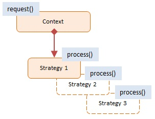
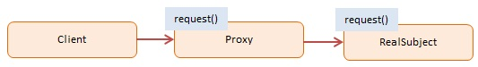

### Tổng hợp toàn bộ cách viết code clean + master với Javascript và Thư viện ReactJS

### Data Structure

1. SET

- Sẽ trả ra các giá trị không trùng lặp
- Thứ tự được lưu không giống như đầu vào => Không có phương thức nào để lấy ra được một giá trị trong tập hợp
- Cũng không cần thiết để lấy giá trị ra khỏi một SET bởi trong này chứa các giá trị không trùng nhau => Việc của ta là check xem một giá trị có nằm trong Set hay không thông qua các phương thức của nó.

```js
const ordersSet = new Set([1, 2, 1, 3, 2, 3, 5, 6, 7, 8]);
console.log(ordersSet);
// OUTPUT: Set(7) { 1, 2, 3, 5, 6, 7, 8 }

console.log(new Set("Hello")); // OUTPUT: Set(4) { 'H', 'e', 'l', 'o' }

ordersSet.clear(); // Xóa toàn bộ
```

- Cách log từng giá trị trong SET

```js
const ordersSet = new Set([1, 2, 1, 3, 2, 3, 5, 6, 7, 8]);

for (const item of ordersSet) {
  console.log(item);
  // OUTPUT:
  // 1
  // 2
  // 3
  // 5
  // 6
  // 7
  // 8
}
```

- Loại bỏ các giá trị trùng lặp

```js
const ArrayDuplicateValue = ["Dat", "Mai", "Mgoc", "Vy", "Dat", "Vy"];
const ArrayUniqueValue = [...new Set(ArrayDuplicateValue)];
console.log(ArrayUniqueValue); // [ 'Dat', 'Mai', 'Mgoc', 'Vy' ]
```

2. Map trong javascript

- Giúp chúng ta có thể ánh xạ các giá trị thành các khóa
- Kiểu giá trị trong object có thể là bất kì loại nào (Trong object, tất cả các key phải là một chuỗi, nếu không truyền vào chuỗi nó cũng tự động chuyển sang dạng chuỗi)

- phương thức Set trong Map nó cũng trả ra một Map

```js
const myMap = new Map();
myMap.set("name", "Trần Tuấn Đạt");
myMap.set(1234, 10);
const newMap = myMap.set([12, 23], 2133);
console.log(newMap); // Map(3) { 'name' => 'Trần Tuấn Đạt', 1234 => 10, [ 12, 23 ] => 2133 }
```

=> Có thể áp dụng tính chất này như sau:

```js
const myMap = new Map();
const newMap = myMap.set("hihi", "Hehe").set(1, "123");
console.log(newMap);

// GET
const myMap = new Map();
const newMap = myMap.set("hihi", "Hehe").set(1, "123");
console.log(newMap.get(1));
```

- Kiểm tra xem tại một thời điểm, một nhà hàng có mở cửa hay không

```js
const myMap = new Map();
myMap
  .set("open", 11)
  .set("close", 23)
  .set(false, "We are close")
  .set(true, "We are Open");

const time = 21;
const time2 = 24;
console.log(myMap.get(time >= myMap.get("open") && time < myMap.get("close"))); // We are Open
console.log(
  myMap.get(time2 >= myMap.get("open") && time2 < myMap.get("close")) // We are close
);
```

- Khi get thì phải truyền vào cùng một đối tượng, như ví dụ sau:

```js
const myMap = new Map();
myMap
  .set("open", 11)
  .set("close", 23)
  .set(false, "We are close")
  .set(true, "We are Open")
  .set([1, 2], "HIHI");

console.log(myMap.get([1, 2])); // undefined, vì [1, 2] ở đối tượng khi set khác với [1, 2] lúc truyền vào
```

```js
const myMap = new Map();
const arr = [1, 2];
myMap
  .set("open", 11)
  .set("close", 23)
  .set(false, "We are close")
  .set(true, "We are Open")
  .set(arr, "HIHI");

console.log(myMap.get(arr)); // HIHI
```

NOTE: Map có thể nhận key là bất kì đối tượng nào: VD sử dụng querySelector... để làm key

- Chèn giá trị khi khởi tạo Map

```js
const myMap = new Map([
  ["key", "value"],
  [1, 2],
  ["hihi", 12],
]);
console.log(myMap); // Map(3) { 'key' => 'value', 1 => 2, 'hihi' => 12 }
```

- Convert Object to map

```js
const test = {
  a: 1,
  b: 2,
  c: 3,
};

console.log(Object.entries(test)); // [ [ 'a', 1 ], [ 'b', 2 ], [ 'c', 3 ] ]

// Practice
const test = {
  a: 1,
  b: 2,
  c: 3,
};

const myMap = new Map(Object.entries(test));

// Log key, value
const myMap = new Map([
  ["key", "value"],
  [1, 2],
  ["hihi", 12],
]);

for (const [key, value] of myMap) {
  console.log([key, value]);
}

// Convert Map to Array
const myMap = new Map([
  ["key", "value"],
  [1, 2],
  ["hihi", 12],
]);

console.log([...myMap]);

// Log all keys map
console.log(myMap.entries()); // Để chuyển thành mảng thì sử dụng destructuring

// Log all values map
console.log(myMap.values()); // Để chuyển thành mảng thì sử dụng destructuring
```

3. The Intersection Observer API

```js
// CSS
.container {
  height: 1500px;
}

.content {
  background: red;
}

// HTML
<!DOCTYPE html>
<html lang="en">
  <head>
    <meta charset="UTF-8" />
    <meta http-equiv="X-UA-Compatible" content="IE=edge" />
    <meta name="viewport" content="width=device-width, initial-scale=1.0" />
    <title>Document</title>
    <link rel="stylesheet" href="./main.css" />
  </head>
  <body>
    <div class="container"></div>
    <div class="content">Hello</div>
    <div class="container"></div>
  </body>
  <script src="./abc.js"></script>
</html>

// JS
const obsCallback = function (entries, observer) {
  // Giá trị đầu tiên trong mảng entries được hiểu nếu cuộn từ dưới lên đến viewport bên dưới thì nó có thuộc tính giao nhau là true
  // ngược lại, khi giao với viewport bên trên (từ trên kéo xuống) thì thuộc tính giao nhau là true
  console.log({ entries, observer });
};

const obsOptions = {
  root: null, // Khu vực cần giao nhau, nếu đặt là null thì mặc định lấy sự giao nhau giữa section và viewPort
  threshold: 1, // property này sẽ có giá trị từ 0-1 biểu thị cho giá trị * 100 (Tính theo %)
  // Giả sử box cao 100px mà threshold: 0 => chỉ cần vừa giao nhau là callback được gọi, nếu đặt = 1 thì cần kéo hết chiều dài box thì callback mới được gọi
  // cũng có thể truyền vào threshold một mảng: VD: [0, 1] => Cứ lúc nào ngưỡng đạt 2 mốc này nó đều gọi callback,
  rootMargin: "-5px", // Ngưỡng theo px
};
const observer = new IntersectionObserver(obsCallback, obsOptions);
const section = document.querySelector(".content");
observer.observe(section);
```

### OOP JAVASCRIPT

- Trong Javascript, OOP được linked với một Prototype nhất định
  => Mỗi đối tượng có một Prototype

- Prototype chứa tất cả những phương thức và thuộc tính mà tất cả các đối tượng được liên kết với nguyên mẫu đó và có thể truy cập và sử dụng => Hành vi này được gọi là kế thừa nguyên mẫu

1. Câu hỏi: Làm thế nào để chúng ta có thể tạo prototype và làm thế nào để chúng ta có thể link object đến prototype và làm thế nào để chúng ta có thể tạo một object mới mà không có classes

- Rep:
  - Có 3 cách:
    - Constructor functions
    - ES6 Classes
    - Object.create()

2. Constructor Functions and the new Operator

```js
const Person = function (firstName, birthYear) {};

const dat = new Person("Đạt", 2002);
console.log(dat);

// Các bước thực hiện trong đoạn code trên
// 1. New {} is created
// 2. function is called, this = {}
// 3. {} linked to prototype
// 4. function automatically return {}
```

- instanceof

```js
const Person = function (firstName, birthYear) {
  this.firstName = firstName;
  this.birthYear = birthYear;
};

const dat = new Person("Đạt", 2002);
console.log(dat instanceof Person); // true
```

- Tạo phương thức

```js
const Person = function (firstName, birthYear) {
  this.firstName = firstName;
  this.birthYear = birthYear;

  this.calcAge = function () {
    console.log(2023 - this.birthYear);
  };
};

const dat = new Person("Đạt", 2002);
console.log(dat.calcAge()); // true
```

- KHÔNG nên tạo phương thức bên trong một constructor function như trên bởi vì giả sử nếu chúng ta tạo ra nhiều instances của function constructor này thì mỗi đối tượng sẽ tạo các phương thức mới trong đó (Ảnh hưởng xấu tới performance), điều này là không cần thiết bởi vì mọi đối tượng nên được sử dụng chung các phương thức đó => Để khắc phục vấn đề này chúng ta nên sử dụng prototype

- Lưu ý rằng function constructor không thực sự là một tính năng trong javascript, bởi vì những tính năng này được xây dựng bởi các nhà phát triển và bây giờ mọi người chỉ đơn giản là sử dụng điều này

- Mọi function trong prototype đều tự động có một thuộc tính là prototype và tất nhiên bao gồm các hàm khởi tạo => Mọi object được tạo bởi một hàm khởi tạo nhất định sẽ có quyền truy cập vào tất cả các phương thức và thuộc tính mà chúng ta xác định trên thuộc tính nguyên mẫu của hàm tạo

```js
const Person = function (firstName, birthYear) {
  this.firstName = firstName;
  this.birthYear = birthYear;
};

Person.prototype.calcAge = function () {
  console.log(2022 - this.birthYear);
};
const dat = new Person("Đạt", 2002);
dat.calcAge();
console.log(dat.__proto__); // In ra proto của đối tượng này
// => Prototype (Nguyên mẫu) của đối tượng về cơ bản là thuộc tính của Prototype của constructor function

console.log(dat.__proto__ === Person.prototype); // true
// prototype trong Person.prototype thực sự không phải là prototype của Person,  thay vào đó nó sẽ là prototype của tất cả các đối tượng được tạo bằng hàm khởi tạo bằng hàm khởi tạo Person

// Để chứng minh điều trên ta làm như sau:
console.log(Person.prototype.isPrototypeOf(dat)); // true
console.log(Person.prototype.isPrototypeOf(Person)); // false
```

- Có thể thêm thuộc tính trong prototype

```js
const Person = function (firstName, birthYear) {
  this.firstName = firstName;
  this.birthYear = birthYear;
};
Person.prototype.gender = "Male";
const dat = new Person("Đạt", 2002);
console.log(dat.gender); // Male
```

- Khi thực hiện bước trên sau đó log ra `dat` thì đối tượng này sẽ không xuất hiện thuộc tính gender bởi gender nó không thuộc trực tiếp đối tượng này. để kiểm tra một thuộc tính có phải là property của một đối tượng hay không thì chúng ta sử dụng `dat.hasOwnProperty` như sau:

```js
const Person = function (firstName, birthYear) {
  this.firstName = firstName;
  this.birthYear = birthYear;
};
Person.prototype.gender = "Male";
const dat = new Person("Đạt", 2002);
console.log(dat); // Person { firstName: 'Đạt', birthYear: 2002 }
console.log(dat.hasOwnProperty("gender")); // false do gender không thực sự nằm trong đối tượng `dat`
```

4. Prototypal Inheritance and The Prototype Chain (Kế thừa nguyên mẫu, chuỗi nguyên mẫu)

- Chúng ta bắt đầu với function constructor `Person`, hàm khởi tạo này có một thuộc tính nguyên mẫu là một object, và bên trong object đó chúng ta định nghĩa phương thức calcAge và bản thân Person.prototype cũng có một tham chiếu tới Person là constructor property. Vì vậy, về cơ bản, constructor `Person.prototype` sẽ trỏ lại chính Person

- Điều gì sẽ xảy ra khi gọi một `new Operator`
  1. Một đối tượng trống được tạo ra ngay lập tức
  2. `This keyword` trong constructor function được đặt thành đối tượng mới được tạo, bên trong ngữ cảnh thực thi của function, this là empty object => Đó là lý do tại sao chúng ta sử dụng `this.firstName = firstName` có nghĩa là nó đang gán từng thuộc tính vào đối tượng mới
  3. Đối tượng mới được liên kết (`__proto__` property) với property của function constructor (Person.prototype), điều này xảy ra bên dưới bằng cách thêm property `__proto__` vào đối tượng mới. vì vậy, `Person.prototype` bây giờ là prototype đối với đối tượng mới được biểu thị trong property `__proto__` của instance của đối tượng được tạo ra từ function constructor
  4. Đối tượng mới được trả về từ việc gọi constructor function

```js
const Person = function (firstName, birthYear) {
  this.firstName = firstName;
  this.birthYear = birthYear;
};
Person.prototype.calcAge = () => {
  return 2022 - this.birthYear;
};
const dat = new Person("Đạt", 2002);
console.log(dat.gender);
```

=> Trong đoạn code trên việc sử dụng `dat.gender` thì Javascritp thực chất sẽ không thể tìm thấy phương thức này, lúc đó nó mới đi vào prototype để tìm kiếm phương thức này, Hành động đó được gọi là `Prototypal Inheritance/Prototypal delegation` => nói cách khác thì đối tượng `dat` đã kế thừa phương thức `calcAge` từ nguyên mẫu của nó hay còn nói cách khác là nó đã ủy quyền phương thức `calcAge` cho prototype của nó (Đây gọi là Prototype chain)

```js
const Person = function (firstName, birthYear) {
  this.firstName = firstName;
  this.birthYear = birthYear;
};
Person.prototype.gender = "Male";
const dat = new Person("Đạt", 2002);

console.log(dat.__proto__.constructor);
// TOP OF PROTOTYPE CHAIN
console.log(dat.__proto__.__proto__);
console.log(Person.prototype.constructor);
```

=> Hãy thử console.dir(element) sẽ thấy được một Prototype chain khổng lồ khi mở thuộc tính `proto`

- Lưu ý: Mọi object trong javascript đều có prototype, và tất nhiên `Person.prototype` cũng là một object và nó có prototype của riêng mình. Prototype của nó là Object.prototype, vì vậy khi gọi một phương thức hoặc một thuộc tính từ một instance, javascript sẽ bắt đầu tìm phương thức được gọi trên chính đối tượng, nếu không tìm thấy thì nó sẽ đi lên Person.prototype, nếu không tìm thấy nữa thì nó sẽ tiếp tục đi lên Object.prototype

### ES6 Classes

```js
// class expression
const PersonClEx = class {};

// class declaration
class PersonCl {
  constructor(firstName, birthYear) {
    this.firstName = firstName;
    this.birthYear = birthYear;
  }
  // Methods will be added to .prototype property
  calcAge() {
    return 2023 - this.birthYear;
  }
}
// Có thể viết như sau (Nó có tác dụng giống việc viết hàm trong class)
// PersonCl.prototype.greet = function() {
//   console.log(`Hey ${this.firstName}`);
// }
const dat = new PersonCl("Tran Tuan Dat", 2002);
console.log(dat);
```

- Lưu ý:
  - Class không được hoisted (Bất kể nó là expression hay declare)
  - Class có thể được chuyển vào bên trong một hàm và cũng có thể được trả ra từ một hàm
  - Phần thân của class luôn được thực thi ở `strict mode`

### SETTER & GETTER

```js
// OBJECT
const account = {
  owner: "Jonas",
  movements: [200, 530, 120, 300],
  get latest() {
    return this.movements.slice(-1).pop();
  },
  set latest(mov) {
    this.movements.push(mov);
  },
};
// latest lúc này như một thuộc tính của account
console.log(account.latest);
account.latest = 50;

// CLASS
class PersonCl {
  constructor(fullName, birthYear) {
    // Do có setter nên mỗi lần tạo ra một PersonCl mới thì nó sẽ chạy vào setter
    this._fullName = fullName;
    this.birthYear = birthYear;
  }
  calcAge() {
    return 2023 - this.birthYear;
  }
  get age() {
    return 2023 - this.birthYear;
  }
  set fullName(name) {
    if (name.includes(" ")) this_.fullName = name;
    else console.log(`${name} is not a fullName`);
  }
}

const newPerson = new PersonCl("Tuan", 2002);
```

### Static Methods

- Khi ta sử dụng `Array.from()` nhưng không thể sử dụng `[1, 2, 3].from()` => Đó là bởi vì phương thức này được gắn với toàn bộ hàm khởi tạo chứ không phải prototype thế nên các mảng không thể kế thừa phương thức này

```js
class Person {
  constructor(fullName, birthYear) {
    // Do có setter nên mỗi lần tạo ra một PersonCl mới thì nó sẽ chạy vào setter
    this._fullName = fullName;
    this.birthYear = birthYear;
  }
  calcAge() {
    return 2023 - this.birthYear;
  }
  get age() {
    return 2023 - this.birthYear;
  }
  set fullName(name) {
    if (name.includes(" ")) this_.fullName = name;
    else console.log(`${name} is not a fullName`);
  }
}
Person.hey = function () {
  console.log("Hello");
};

const dat = new Person("Tuan Dat", 2002);
// dat.hey(); Không tồn tại hàm này vì đối tượng `dat` không được kế thừa phương thức này
Person.hey();
```

- ĐỂ LÀM ĐIỀU TƯƠNG TỰ TRÊN CÓ THỂ LÀM NHƯ SAU

```js
class Person {
  constructor(fullName, birthYear) {
    // Do có setter nên mỗi lần tạo ra một PersonCl mới thì nó sẽ chạy vào setter
    this._fullName = fullName;
    this.birthYear = birthYear;
  }
  calcAge() {
    return 2023 - this.birthYear;
  }
  get age() {
    return 2023 - this.birthYear;
  }
  set fullName(name) {
    if (name.includes(" ")) this_.fullName = name;
    else console.log(`${name} is not a fullName`);
  }
  static hey() {
    console.log("Hello");
  }
}

const dat = new Person("Tuan Dat", 2002);
// dat.hey(); Không tồn tại hàm này vì đối tượng `dat` không được kế thừa phương thức này
Person.hey();
```

### Object.create

```js
const PersonProto = {
  calcAge() {
    console.log(2023 - this.birthYear);
  },
  init(firstName, birthYear) {
    this.firstName = firstName;
    this.birthYear = birthYear;
  },
};
// Tạo ra một object mới có proto là `PersonProto`
const steven = Object.create(PersonProto);
console.log(steven);
steven.name = "Steven";
steven.birthYear = 2002;
steven.calcAge();
console.log(steven.__proto__ === PersonProto); // true

const sarah = Object.create(PersonProto);
sarah.init("Sarah", 1997);
```

### . Inheritance Between "Classes": Constructor Functions

```js
const Person = function (firstName, birthYear) {
  this.firstName = firstName;
  this.birthYear = birthYear;
};

Person.prototype.calcAge = function () {
  console.log(2023 - this.birthYear);
};

const Student = function (firstName, birthYear, course) {
  Person.call(this, firstName, birthYear);
  this.course = course;
};

Student.prototype.introduce = function () {
  console.log(`My name is ${this.firstName} and I study ${this.course}`);
};

const mike = new Student("Mike", 2020, "Computer Science");
mike.introduce();
console.log(mike.calcAge()); // Hẹo do chưa kế thừa được từ Person
```

- Ví dụ khác

```js
const Person = function (firstName, birthYear) {
  this.firstName = firstName;
  this.birthYear = birthYear;
};

Person.prototype.calcAge = function () {
  console.log(2023 - this.birthYear);
};
const Student = function (firstName, birthYear, course) {
  Person.call(this, firstName, birthYear);
  this.course = course;
};
// Linking prototypes
Student.prototype = Object.create(Person.prototype);
Student.prototype.introduce = function () {
  console.log(`My name is ${this.firstName} and I study ${this.course}`);
};

const mike = new Student("Mike", 2020, "Computer Science");
mike.calcAge(); // 3
console.log(mike.__proto__); // Person { introduce: [Function (anonymous)] }
console.log(mike.__proto__.__proto__); // { calcAge: [Function (anonymous)] }
console.log(Student.prototype.constructor); // [Function: Person] // Điều này là chưa đúng lắm, Fix như sau:

Student.prototype.constructor = Student;
console.log(Student.prototype.constructor); // [Function: Student]
console.log(mike instanceof Student); // true
console.log(mike instanceof Person); // true
console.log(mike instanceof Object); // true
```

### Inheritance Between "Classes": ES6 Classes

```js
class PersonCl {
  constructor(fullName, birthYear) {
    this.fullName = fullName;
    this.birthYear = birthYear;
  }
  // Instance methods
  calcAge() {
    console.log(2037 - this.birthYear);
  }
  greet() {
    console.log(`Hey ${this.fullName}`);
  }
  get age() {
    return 2023 - this.birthYear;
  }
  set fullName(name) {
    if (name.includes(" ")) this._fullName = name;
    else console.log(`${name} is not a full name!`);
  }
  get fullName() {
    return this._fullName;
  }

  // Static method
  static hey() {
    console.log("Hey there");
  }
}

class StudentCl extends PersonCl {
  constructor(fullName, birthYear, course) {
    super(fullName, birthYear);
    this.course = course;
  }
}

const mike = new StudentCl("Mike Low", 2002, "Computer Science");
mike.greet();
```

### Inheritance Between "Classes": Object.create

```js
const PersonProto = {
  calcAge() {
    console.log(2037 - this.birthYear);
  },
  init(firstName, birthYear) {
    this.firstName = firstName;
    this.birthYear = birthYear;
  },
};

const steven = Object.create(PersonProto);

const StudentProto = Object.create(PersonProto);
StudentProto.init = function (firstName, birthYear, course) {
  PersonProto.init.call(this, firstName, birthYear);
  this.course = course;
};
StudentProto.introduce = function () {
  console.log(`My name is ${this.fullName} and I study ${this.course}`);
};

const jay = Object.create(StudentProto);
jay.init("Jay", 2010, "Computer Science");
jay.introduce();
jay.calcAge();
```

### Another Class Example

- Trong ví dụ dưới đây, chúng ta tạo một chức năng mô phỏng luồng của một ngân hàng, cho phép gửi tiền, rút tền và vay, ...

```js
class Account {
  constructor(owner, currency, pin) {
    this.owner = owner;
    this.currency = currency;
    this.pin = pin;
    this.movements = [];
    this.local = navigator.language;
  }
  // Public interface
  deposit(val) {
    this.movements.push(val);
  }
  withDraw(val) {
    this.movements.deposit(-val);
  }
  approveLoan(val) {
    return true;
  }
  requestLoan(val) {
    if (this.approveLoan(val)) {
      this.deposit(val);
      console.log(`Loan approved`);
    }
  }
}

const acc1 = new Account("Jonas", "EUR", 1111);
acc1.deposit(250);
acc1.withDraw();
acc1.approveLoan(1000);
```

### Encapsulation: Protected Properties and Methods (Tính đóng gói trong javascript)

- Ví dụ sau đây chúng ta có thể làm, mặc dù nó không đúng lắm, Để thuộc tính là private thì chỉ cần thêm `_` vào trước thuộc tính đó, và chúng ta quy ước là mọi biến được bắt đầu bằng `_` thì chúng ta không được phép thao tác trực tiếp với chúng (Cũng có thể áp dụng cách này cho các method)

```js
class Account {
  constructor(owner, currency, pin) {
    this.owner = owner;
    this.currency = currency;
    this.pin = pin;
    this.local = navigator.language;
    // Protected properties
    this._movements = [];
  }
  // Public interface
  deposit(val) {
    this._movements.push(val);
  }
  withDraw(val) {
    this.deposit(-val);
  }
  approveLoan(val) {
    return true;
  }
  requestLoan(val) {
    if (this.approveLoan(val)) {
      this.deposit(val);
      console.log(`Loan approved`);
    }
  }
}

const acc1 = new Account("Jonas", "EUR", 1111);
acc1.deposit(250);
acc1.withDraw(100);
acc1.approveLoan(1000);
acc1._movements;
```

### Encapsulation: Private Class Fields and Methods

- Public fields
- Private fields
- Public method
- Private method

```js
class Account {
  // public fields, cần viết ở đầu như vậy (Không cần sử dụng từ khóa const hay let để khai báo)
  local = navigator.language;
  movements = [];
  // private fields, Để một field là private chúng ta chỉ cần thêm cho nó dấu `#` ở đầu tiên, Lưu ý để truy cập vào private field sử dụng this.#private_field_name
  #privateField = [];
  #pin;
  constructor(owner, currency, pin) {
    this.owner = owner;
    this.currency = currency;
    this.#pin = pin;
    this.local = navigator.language;
    // Protected properties
    this.movements = [];
  }
  // Public interface
  deposit(val) {
    this.movements.push(val);
  }
  withDraw(val) {
    this.deposit(-val);
  }
  approveLoan(val) {
    return true;
  }
  requestLoan(val) {
    if (this.approveLoan(val)) {
      this.deposit(val);
      console.log(`Loan approved`);
    }
  }
}

const acc1 = new Account("Jonas", "EUR", 1111);
acc1.deposit(250);
acc1.withDraw(100);
acc1.approveLoan(1000);
```

### Chaining Methods

```js
class Account {
  constructor(owner, currency, pin) {
    this.movements = [];
    this.owner = owner;
    this.currency = currency;
    // Protected properties
    this.movements = [];
  }
  // Public interface
  deposit(val) {
    this.movements.push(val);
    return this;
  }
  withDraw(val) {
    this.deposit(-val);
    return this;
  }
  approveLoan(val) {
    return true;
  }
  requestLoan(val) {
    if (this.approveLoan(val)) {
      this.deposit(val);
      console.log(`Loan approved`);
      return this;
    }
  }
}

const acc1 = new Account("Jonas", "EUR", 1111);
acc1.deposit(250).withDraw(100);
console.log(acc1);
```

### DESIGN PATERNS

- `DESIGN PATTERNS` là gì?

  - Design pattern là các giải pháp tổng thể đã được tối ưu hóa, được tái sử dụng cho các vấn đề phổ biến trong thiết kế phần mềm mà chúng ta thường gặp phải hàng ngày. Đây là tập các giải pháp đã được suy nghĩ, đã giải quyết trong tình huống cụ thể.

- `DESIGN PATTERNS` có tác dụng gì?

  - Những lập trình viên có thể áp dụng giải pháp này để giải quyết các vấn đề tương tự. Các vấn đề mà bạn gặp phải có thể bạn sẽ tự nghĩ ra cách giải quyết nhưng có thể nó chưa phải là tối ưu.
  - Bạn cần phải hiểu rõ nó không phải là ngôn ngữ cụ thể nào cả. Design patterns có thể thực hiện được ở phần lớn các ngôn ngữ lập trình. Nó giúp bạn giải quyết vấn đề một cách tối ưu nhất, cung cấp cho bạn các giải pháp trong lập trình hướng đối tượng (OOP).

- Tại sao lại sử dụng `DESIGN PATTERNS`?

  - Giúp sản phẩm của chúng ta linh hoạt, dễ dàng thay đổi và bảo trì hơn.
  - Có một điều luôn xảy ra trong phát triển phần mềm, đó là sự thay đổi về yêu cầu. Lúc này hệ thống phình to, các tính năng mới được thêm vào trong khi performance cần được tối ưu hơn.
  - Design pattern cung cấp những giải pháp đã được tối ưu hóa, đã được kiểm chứng để giải quyết các vấn đề trong software engineering. Các giải pháp ở dạng tổng quát, giúp tăng tốc độ phát triển phần mềm bằng cách đưa ra các mô hình test, mô hình phát triển đã qua kiểm nghiệm.
  - Những lúc khi bạn gặp bất kỳ khó khăn đối với những vấn đề đã được giải quyết rồi, design patterns là hướng đi giúp bạn giải quyết vấn đề thay vì tự tìm kiếm giải pháp tốn kém thời gian.
  - Giúp cho các lập trình viên có thể hiểu code của người khác một cách nhanh chóng (có thể hiểu là các mối quan hệ giữa các module chẳng hạn). Mọi thành viên trong team có thể dễ dàng trao đổi với nhau để cùng xây dựng dự án mà không tốn nhiều thời gian.

- Khi nào nên sử dụng `DESIGN PATTERNS`?

  - Việc sử dụng các design pattern sẽ giúp chúng ta giảm được thời gian và công sức suy nghĩ ra các cách giải quyết cho những vấn đề đã có lời giải. Lợi ích của việc sử dụng các mô hình Design Pattern vào phần mềm đó chính là giúp chương trình chạy uyển chuyển hơn, dễ dàng quản lý tiến trình hoạt động, dễ nâng cấp bảo trì, …
  - Tuy nhiên điểm bất cập của design pattern là nó luôn là một lĩnh vực khá khó nhằn và hơi trừu tượng. Khi bạn viết code mới từ đầu, khá dễ dàng để nhận ra sự cần thiết phải có mẫu thiết kế. Tuy nhiên, việc áp dụng mẫu thiết kế cho code cũ thì khó khăn hơn.
  - Khi sử dụng những mẫu design pattern có sẵn thì chúng ta sẽ đối mặt với một vấn đề nữa là perfomance của product (code sẽ chạy chậm chẳng hạn). Cần phải chắc chắn là bạn đã hiểu toàn bộ mã nguồn làm việc như thế nào trước khi đụng vào nó. Việc này có thể là dễ dàng hoặc là đau thương, phụ thuộc vào độ phức tạp của code.
  - Hiện nay chúng ta đang áp dụng rất nhiều design pattern vào công việc lập trình của mình. Nếu bạn thường tải và cài đặt các thư viện, packages hoặc module nào đó thì đó là lúc bạn thực thi một design pattern vào hệ thống.
  - Tất cả các framework cho ứng dụng web như Laravel, Codeigniter… đều có sử dụng những kiến trúc design pattern có sẵn và mỗi framework sẽ có những kiểu design pattern riêng.

- NOTE: Khi tìm hiểu một `DESIGN PATTERNS` cần nắm được những yêu cầu sau:

  1. Hiểu được mục đích của `DESIGN PATTERNS` này là gì?
  2. Nó giải quyết vấn đề gì?
  3. Sử dụng nó khi nào?
  4. Thực hành SML
  5. Không lạm dụng các PATTERN, không cố gắng sử dụng tất cả các pattern trong một hệ thống

- Các loại `DESIGN PATTERNS`


### **STRATEGY PATTERN**

**LEVEL 1:**

```js
// Chưa dùng STRATEGY PATTERN
function getPrice(orginalPrice, typePromotion = "default") {
  // Giảm giá khi người dùng đặt trước một sản phẩm của VINFAST
  if (typePromotion === "preOrder") {
    return orginalPrice * 0.8; // Giảm 20%
  } // Ở giai đoạn này nếu nhưu bạn đã biết về SOLID thì nó đã phá vỡ nguyên tắc đầu tiên. Đó là nguyên tắc t
  // Tiếp tục thêm tính năng khuyến mãi thông thường, ví dụ giá gốc < 200 thì giảm 10%, Còn > thì giảm t
  if (typePromotion === "promotion") {
    return orginalPrice <= 200 ? orginalPrice * 0.9 : orginalPrice - 30;
  }
  // Thời xưa chưa có marketing như bây giờ
  if (typePromotion === "default") {
    return orginalPrice;
  }
}

console.log("-------> PRICE:::", getPrice(200, "preOrder"));

// ĐOẠN CODE TRÊN GẶP VẤN ĐỀ: NẾU CÓ THÊM NGÀY GIẢM GIÁ THÌ LẠI PHẢI IF THÊM NỮA
```

**LEVEL 2**: Cách này tối ưu hơn ở việc tách hàm riêng, tuy nhiên vẫn còn vấn đề sử dụng `if else`

```js
// dùng STRATEGY PATTERN
/**
 * Giảm giá khi người dùng đặt trước một sản phẩm của VINFAST
 * @params {*} originalPrice
 * @returns
 */
function preOrderPrice(originalPrice) {
  return originalPrice * 0.8;
}

/**
 * Tiếp tục thêm tính năng khuyến mãi thông thường, ví dụ nếu giá gốc < 200 thì giảm 10%, còn lớn hơn thì giảm tối da 30
 * @params {*} originalPrice
 * @returns
 */
function promotionPrice(orginalPrice) {
  return originalPrice <= 200 ? originalPrice * 0.9 : orginalPrice - 30;
}

/**
 * Giá mặc định
 * @params {*} originalPrice
 * @returns
 */
function defaultPrice(orginalPrice) {
  return orginalPrice;
}

/**
 * Giảm giá theo ngày
 * @params {*} originalPrice
 * @returns
 */
function dayPrice(orginalPrice) {
  return orginalPrice * 0.6;
}

// Và chúng ta sẽ sửa đổi lại như sau:
function getPrice(originalPrice, typePromotion) {
  if (typePromotion === "preOrder") {
    return preOrderPrice(originalPrice);
  }
  if (typePromotion === "promotion") {
    return promotionPrice(originalPrice);
  }
  if (typePromotion === "default") {
    return defaultPrice(originalPrice);
  }
}

console.log("-------> PRICE:::", getPrice(200, "preOrder"));
```

**LEVEL 3**: Cách này đã tối ưu hóa vấn đề sử dụng if else ở LEVEL 2

```js
// dùng STRATEGY PATTERN
/**
 * Giảm giá khi người dùng đặt trước một sản phẩm của VINFAST
 * @params {*} originalPrice
 * @returns
 */
function preOrderPrice(originalPrice) {
  return originalPrice * 0.8;
}

/**
 * Tiếp tục thêm tính năng khuyến mãi thông thường, ví dụ nếu giá gốc < 200 thì giảm 10%, còn lớn hơn thì giảm tối da 30
 * @params {*} originalPrice
 * @returns
 */
function promotionPrice(orginalPrice) {
  return originalPrice <= 200 ? originalPrice * 0.9 : orginalPrice - 30;
}

/**
 * Giá mặc định
 * @params {*} originalPrice
 * @returns
 */
function defaultPrice(orginalPrice) {
  return orginalPrice;
}

/**
 * Giảm giá theo ngày
 * @params {*} originalPrice
 * @returns
 */
function dayPrice(orginalPrice) {
  return orginalPrice * 0.6;
}

const getPriceStrategies = {
  preOrder: preOrderPrice,
  promotion: promotionPrice,
  blackFriday: blackFridayPrice,
  dayPrice,
  default: defaultPrice,
};

function getPrice(originalPrice, typePromotion) {
  return getPriceStrategies[typePromotion](originalPrice);
}

console.log("-------> PRICE:::", getPrice(200, "preOrder"));
```

**TÌM HIỂU THÊM**

- `Strategy pattern` đóng gói các thuật toán thay thế cho một tác vụ cụ thể, nó cho phép một phương thức được hoán đổi trong thời gian chạy bằng bất kì phương thức (Strategy) nào khác mà khách hàng không nhận ra. Về cơ bản `Strategy` là một nhóm các thuật toán có thể hoán đổi cho nhau

- Cùng ngắm nhìn diagram của pattern



- Trong ví dụ dưới đây, Những đối tượng tham gia pattern là:

  - Context: Shipping
    - Duy trì một tham chiếu tới strategy object hiện tại
    - Hỗ trợ interface cho phép client yêu cầu tính toán Strategy
    - Cho phép Client thay đổi Strategy
  - Strategy: trong ví dụ này là `UPS USPS Fedex`.

    - Triển khai thuật toán sử dụng Strategy interface

- Mô tả ví dụ: Chúng ta có một đơn hàng được gửi tới khách hàng, các công ty vận chuyển có các mức giá khác nhau, cần xác định mức giá tiết kiệm nhất để vận chuyển, điều này có thể hữu ích với các giỏ hàng nơi khách hàng chọn options giao hàng và Selected Strategy sẽ đưa ra chi phí dự tính
- `Shipping là Context và 3 shipping companies UPS, USPS, Fedex` là các Strategies. Các công ty vận chuyển (Strategies) được thay đổi 3 lần và mỗi lần chúng ta tính toán chi phí vận chuyển. Trong tình huống thực tế, các phương thức tính toán có thể gọi đến dịch vụ web của người gửi hàng, cuối cùng chúng sẽ hiển thị các chi phí khác nhau.

```js
const Shipping = function () {
  this.company = "";
};

Shipping.prototype = {
  setStrategy: function (company) {
    this.company = company;
  },
  calculate: function (package) {
    return this.company.calculate(package);
  },
};

const UPS = function () {
  this.calculate = function (package) {
    // calculations...
    return "$45.95";
  };
};

const USPS = function () {
  this.calculate = function (package) {
    // calculations...
    return "$39.40";
  };
};

const Fedex = function () {
  this.calculate = function (package) {
    // calculations...
    return "$43.20";
  };
};

function run() {
  const package = { from: "76712", to: "10012", weigth: "lkg" };

  // the 3 strategies

  const ups = new UPS();
  const usps = new USPS();
  const fedex = new Fedex();

  const shipping = new Shipping();

  shipping.setStrategy(ups);
  console.log("UPS Strategy: " + shipping.calculate(package));
  shipping.setStrategy(usps);
  console.log("USPS Strategy: " + shipping.calculate(package));
  shipping.setStrategy(fedex);
  console.log("Fedex Strategy: " + shipping.calculate(package));
}

run();

// OUTPUT:
// UPS Strategy: $45.95
// USPS Strategy: $39.40
// Fedex Strategy: $43.20
```

### **OBSERVER PATTERN**

```js
class Observer {
  constructor(name) {
    this.name = name;
  }
  updateStatus(location) {
    this.goToHelp(location);
  }
  goToHelp(location) {
    console.log(`${this.name}::::PING::::${JSON.stringify(location)}`);
  }
}

class Subject {
  constructor() {
    this.observerList = [];
  }
  addObserver(observer) {
    this.observerList.push(observer);
  }
  notify(location) {
    this.observerList.forEach((observer) => observer.updateStatus(location));
  }
}

const subject = new Subject();

// Your pick
const riki = new Observer("Riki");
const sniper = new Observer("Sniper");

// Add riki and Sniper to Team
subject.addObserver(riki);
subject.addObserver(sniper);

// Push location to Team
subject.notify({ long: 123, last: 345 });
```

1. OVERVIEW

- `OBSERVER PATTERN` cung cấp một model subscription, trong đó các đối tượng đăng ký một sự kiện và được thông báo khi sự kiện xảy ra. Pattern này là nền tảng của lập trình hướng sự kiện (Bao gồm cả javascript)
- `OBSERVER PATTERN` tạo điều kiện cho thiết kế hướng đối tượng tốt và thúc đẩy khớp nối lỏng lẻo

2. Using Observer

- Khi xây dựng một ứng dụng web. Bạn sẽ phải viết rất nhiều trình xử lý sự kiện. Trình xử lí sự kiện là những funcions sẽ thực hiện thông báo khi một sự kiện nhất định được kích hoạt. Các thông báo này tùy ý nhận một đối số sự kiện với thông tin chi tiết về sự kiện(Ví dụ: vị trí x và y của chuột tại một sự kiện nhấp chuột)
- Mô hình xử lý sự kiện và sự kiện trong Javascript là biểu hiện của `OBSERVER DESIGN PATTERN`
  - Một tên gọi khác của `OBSERVER PATTERN` là `Pub/Sub` là viết tắt của `Publication/Subscription`

3. Diagram


4. EXAMPLE

- Mô tả ví dụ:

  - Subject: `Click`
    - Duy trì danh sách của `observer`, bất kì đối tượng `Observer` nào cũng có thể quan sát Subject
    - Thực hiện một interface cho phép các đối tượng `Observer` đăng ký hoặc hủy đăng ký
    - Gửi thông báo cho observers khi trạng thái của nó thay đổi
  - Observers: `clickHandler`
    - Có một function signature có thể được gọi khi Subject thay đổi(Tức là khi sự kiện xảy ra)

- Trong ví dụ dưới đây, đối tượng `Click` đại diện cho Chủ thể, hàm `clickHandler` là `subscribing Observer`. Hàm này thực hiện đăng ký, hủy đăng ký và sau đó tự đăng ký trong khi các sự kiện đang kích hoạt. Nó chỉ được thông báo tới các `events#1 và #3`

- Lưu ý rằng, phương thức `fire` chấp nhận hai đối số. Đối số đầu tiên là thông tin chi tiết về ngữ cảnh (Tức là giá trị `this` khi event handlers được gọi). Nếu không có ngữ cảnh(`this`) nào được cung cấp thì nó sẽ nhận global object làm `this` (window)

```js
function Click() {
  this.handlers = []; // observers
}

Click.prototype = {
  subscribe: function (fn) {
    this.handlers.push(fn);
  },
  unsubscribe: function (fn) {
    this.handlers = this.handlers.filter(function (item) {
      if (item !== fn) {
        return item;
      }
    });
  },
  fire: function (o, thisObj) {
    const scope = thisObj || window;
    this.handlers.forEach(function (item) {
      item.call(scope, o);
    });
  },
};

function run() {
  const clickHandler = function (item) {
    console.log("fired: " + item);
  };
  const click = new Click();
  click.subscribe(clickHandler);
  click.fire("event #1");
  click.fire("event #4");
  click.unsubscribe(clickHandler);
  click.fire("event #2");
  click.subscribe(clickHandler);
  click.fire("event #3");
}
```

### **Push or Pull ngăn xếp công nghệ nào được FACEBOOK và INSTAGRAM lựa chọn phát triển NEWS FEED?**

- Xem qua tính năng news feed của facebook, Zalo, Instagram


- Giả sử `Messi` theo dõi 3 người bạn trên facebook thì mỗi lần vào newfeed sẽ phải get 3 request để lấy thông tin về những bài viết trên facebook

=> Nhược điểm của pull Strategy: - Nếu có N users thì cần phải pull N request... - Thời gian chờ đợi để render ra news feed thì lâu

=> Ưu điểm: Giả sử CR7 post một status thì chỉ cần save vào DB của CR7

- **PUSH DESIGN**


- (Lời giải thích này không liên quan tới hình ảnh bên trên) Giả sử `Messi` có 1tr người theo dõi thì khi `Messi` đăng một bài viết thì sẽ có 1 triệu bản ghi(Mỗi bản ghi push tới từng người)

=> Ưu điểm:

- Chỉ cần truy cập vào danh sách news feed của mình là có data
- Nhanh, gọn lẹ

=> Nhược điểm:

- Tỉ lệ ghi cao (Lãng phí DB), Ví dụ CR7 có 1 triệu fllowers thì 1 trệu bản ghi...
- Tốc độ nhận tin của người fllowers có thể chậm hơn người khác

### FACADE PATTERN

- OVERVIEW

```js
class Discount {
  calc(value) {
    return value * 0.9;
  }
}

class Shipping {
  calc() {
    return 5;
  }
}

class Fees {
  calc(value) {
    return value * 1.05; // VAT
  }
}

class ShopeeFacadePattern {
  constructor() {
    this.discount = new Discount();
    this.shipping = new Shipping();
    this.fees = new Fees();
  }
  calc(price) {
    price = this.discount.calc(price);
    console.log("Disscount::", price);
    price = this.fees.calc(price);
    console.log("Fees::", price);
    price += this.shipping.calc();
    console.log("Shipping::", price);
    return price;
  }
}

function buy(price) {
  const shopee = new ShopeeFacadePattern();
  console.log("Price::", shopee.calc(price));
}

buy(12000);
```

### DETAILS

- `FACADE PATTERN` cung cấp một interface bảo vệ client khỏi chức năng phức tạp trong một hoặc nhiều hệ thống con. Nó là một pattern đơn giản, có vẻ tầm thường nhưng nó mạnh mẽ và cực kỳ hữu ích. Nó thường có mặt trong các hệ thống được xây dựng theo kiến trúc nhiều lớp (multi-layer)

### Using Façade

- Mục đích của `Facade` là xây dựng một high-level interface (Các thuộc tính và phương thức) để làm cho một hệ thống con hoặc bộ công cụ dễ sử dụng cho khách hàng.
- Trên máy chủ, trong một ứng dụng web nhiều lớp, bạn thường có một `presentation layer` là ứng dụng khách của lớp dịch vụ. Giao tiếp giữa hai lớp này diễn ra thông qua API được xác định rõ. API này, hoặc `Facade` che giấu sự phức tạp của các business objects (Đối tượng nghiệp vụ) và các tương tác của chúng khỏi `presentation layer`
- Một lĩnh vực khác mà `Facade` được sử dụng là tái cấu trúc, Giả sử bạn có một tập hợp các đối tượng kế thừa khó hiểu hoặc lộn xộn mà client không cần quan tâm. Bạn có thể ẩn mã này đằng sau `Facade`. `Facade` chỉ hiển thị những gì cần thiết và trình bày một giao diện rõ ràng và dễ sử dụng hơn.
- `Facade` thường được kết hợp với các `design pattern` khác. Bản thân `Facade` thường được thực hiện dưới dạng `singleton factories`

### Diagram


### Participants

- Đối tượng tham gia pattern này gồm:

  - `Facade`: `Mortgage`
    - Biết subsystem nào chịu trách nhiệm cho một yêu cầu
    - Ủy quyền các yêu cầu của client cho đối tượng subsystem phù hợp
  - `Sub System`: `Bank Credit Background`
    - implements và thực hiện các subsystem chuyên biệt
    - Không biết về hoặc tham chiếu đến `facade`

- Giải thích ví dụ:
  - Đối tượng `Mortgage` là `Facade` trong ví dụ này. Nó trình bày một interface đơn giản cho client với một phương thức duy nhất là `applyFor`
  - Tên của người nộp đơn được chuyển vào `Mortgage constructor function`. Sau đó phương thức `applyFor` được gọi với số tiền vay được yêu cầu. Trong nội bộ, phương thức này sử dụng các `services` từ 3 subsystems riêng biệt, chúng phức tạp và có thể mất một chút thời gian để xử lí. Chúng ở đây chính là `Bank, Credit và Background`
  - Dựa trên một số tiêu chí như bank statements, credit and criminal background(Báo cáo ngân hàng, báo cáo tín dụng và lịch tư pháp), dựa vào những điều này mà người nộp đơn được chấp nhận hoặc từ chối khoản vay được yêu cầu

**CODE:**

```js
const Mortgage = function (name) {
  this.name = name;
};

Mortgage.prototype = {
  applyFor: function (amount) {
    // access multiple subsystems...
    const result = "approved";
    if (!new Bank().verify(this.name, amount)) {
      result = "denied";
    } else if (!new Credit().get(this.name)) {
      result = "denied";
    } else if (!new Background().check(this.name)) {
      result = "denied";
    }
    return this.name + " has been " + result + " for a " + amount + " mortgage";
  },
};

const Bank = function () {
  this.verify = function (name, amount) {
    // complex logic ...
    return true;
  };
};

const Credit = function () {
  this.get = function (name) {
    // complex logic ...
    return true;
  };
};

const Background = function () {
  this.check = function (name) {
    // complex logic ...
    return true;
  };
};

function run() {
  const mortgage = new Mortgage("Joan Templeton");
  const result = mortgage.applyFor("$100,000");
  console.log(result);
}

run();
```

### PROXY PATTERN


Bạn có suy nghĩ gì về hình ảnh này?

- Giả sử có 3 Client truy cập vào một DB, tuy nhiên nếu làm như vậy thì tốc độ query sẽ chậm. Giả sử DB đặt ở Mỹ và Client truy cập ở Việt Nam thì tất nhiên sẽ chậm

=> Cần có một Proxy ở giữa để điều hướng tới một DB khác gần Client hơn


=> Lúc này Proxy đứng ở giữa sẽ tiếp nhận những request mà Client gửi tới, đồng thời cũng tiếp nhận phản hồi từ DB => Sau đó phản hồi ngược lại Client


- Ví dụ thực tiễn: Giả sử bạn có một ngôi nhà muốn bán, tuy nhiên bạn không có thời gian để gặp trực tiếp khách hàng để bàn bạc => Bạn ủy quyền cho một nhà môi giới => Lúc này nhà môi giới sẽ thay bạn trò chuyện với khách hàng, tuy nhiên mọi quyền quyết định là ở bạn chứ không phải nhà môi giới (VD: Giá nhà, tiền đặt cọc, điều khoản, ...)

=> Người môi giới ở đây đóng vai trò là proxy

- Ví dụ thực tiễn 2: Giả sử bạn yêu cầu được tăng lương, nếu gặp trực tiếp sếp lớn nhất thì người sếp này sẽ tốn rất nhiều thời gian để gặp và nói chuyện => Sếp sẽ nhờ một thư kí để sắp xếp thời gian gặp mặt cho những công việc như vậy, tuy nhiên sếp mới là người quyết định tăng lương cho nhân viên kia.

=> Thư kí ở đây đóng vai trò là proxy

- Ví dụ trong lĩnh vực phần mềm:

  - Khi sử dụng dịch vụ bank của ngân hàng, khi chúng ta chuyển tiền cho người khác thì bản chất phải ủy quyền cho ngân hàng, và quyền quyết định có chuyển tiền hay không là ở chúng ta => Ngân hàng ở đây cũng đóng vai trò là proxy

- Ví dụ 2: Giả sử trong rest API, Nếu không có proxy API thì sẽ bị lộ endpoint. VD viết một API về thời tiết, Các client call API sử dụng fetch hoặc axios nếu để lộ endpoint thì sẽ rất nguy hiểm cho các cuộc tấn công mạng như DDOS, ... Cho nên cần có proxy để nhận request và response nhưng chúng ta mới là người thực hiện quyết định đó

- **Triển khai code**

```js
class Leader {
  receiveRequest(offer) {
    console.log(`result:::${offer}`);
  }
}

class Secretary {
  constructor() {
    this.leader = new Leader();
  }
  receiveRequest(offer) {
    // Date...
    this.leader.receiveRequest(offer);
  }
}

class Developer {
  constructor(offer) {
    this.offer = offer;
  }
  applyFor(target) {
    target.receiveRequest(this.offer);
  }
}

// How to use
const devs = new Developer("anonystick upto 5k USD");
devs.applyFor(new Secretary());
```

**DETAILS**

1. USING PROXY

- `Proxy Pattern` cũng cấp một đối tượng thay thế hoặc giữ chỗ cho một đối tượng khác và kiểm soát quyền truy cập vào đối tượng khác này
- Trong lập trình hướng đối tượng, các đối tượng thực hiện công việc thông qua interface (Thuộc tính và phương thức)
- Client của những đối tượng này mong muốn công việc này được thực hiện nhanh chóng và hiệu quả. Tuy nhiên những tình huống mà một đối tượng bị hạn chế nghiêm trọng và không thể thực hiện trách nghiệm của mình. Thông thường điều này xảy ra khi có sự phụ thuộc vào tài nguyên từ xa(Dẫn đến độ trễ của mạng) hoặc khi một đối tượng mất nhiều thời gian để tải.
- Trong tình huống như thế, bạn nên áp dụng `Proxy Pattern` và tạo một đối tượng `Proxy` đại diện cho đối tượng ban đầu. Proxy chuyển tiếp yêu cầu đến một đối tượng mục tiêu. Interface của đối tượng Proxy giống với đối tượng ban đầu và Client thậm chí có thể không biết rằng họ đang xử lý một proxy chứ không phải một đối tượng thật

2. **Diagram**



- Đối tượng tham gia:
  - `Client`: `run() function`
    - Calls Proxy để yêu cầu một hoạt động
  - `Proxy`: `GeoProxy`
    - Cung cấp một interface giống như một đối tượng thật
    - Duy trì một reference cho phép proxy truy cập vào `real object`
    - Xử lý yêu cầu và chuyển tiếp chúng đến đối tượng thực
  - `RealSubject`: `GeoCoder`
    - Định nghĩa `real object` mà serice được yêu cầu

3. **Example**

- Đối tượng `GeoCoder` mô phỏng dịch vụ mã hóa địa lý của Google Maps. Trong mã hóa địa lý, bạn cung cấp một vị trí (Một điểm trên trái đất) và nó sẽ trả về vĩ độ/ kinh độ (latlng) của nó. `GeoCoder` có thể giải quyết 4 vị trí, nhưng trên thực tế có hàng triệu vị trí, bởi vì nó liên quan đến các quốc giam thành phố và đường phố.
- Lập trình viên đã quyết định triển khai một `Proxy object` bởi vì `GeoCoder khá chậm`. Proxy object được gọi là `GeoProxy`. Được biết, có nhiều yêu cầu lặp lại(cho cùng một vị trí). Để tăng tốc mọi thứ, `GeoProxy` lưu trữ các vị trí được yêu cầu thường xuyên. Nếu một vị trí chưa được lưu vào bộ nhớ đệm, nó sẽ chuyển sang `real GeoCoder service` và lưu kết quả vào bộ nhớ đệm
- Một số địa điểm thành phố được truy vấn và nhiều trong số này là cho cùng một thành phố. `GeoProxy` xây dựng bộ đệm của nó trong khi hỗ trợ các cuộc gọi này. Cuối cùng, `GeoProxy` đã xử lý 11 yêu cầu nhưng chỉ phải chuyển đến `GeoCoder` 3 lần. Lưu ý rằng, chương trình máy khách không có kiến thức về đối tượng proxy (Nó gọi cùng một interface với phương thức getLatLng tiêu chuẩn)

```js
function GeoCoder() {
  this.getLatLng = function (address) {
    if (address === "Amsterdam") {
      return "52.3700° N, 4.8900° E";
    } else if (address === "London") {
      return "51.5171° N, 0.1062° W";
    } else if (address === "Paris") {
      return "48.8742° N, 2.3470° E";
    } else if (address === "Berlin") {
      return "52.5233° N, 13.4127° E";
    } else {
      return "";
    }
  };
}

function GeoProxy() {
  const geocoder = new GeoCoder();
  const geocache = {};

  return {
    getLatLng: function (address) {
      if (!geocache[address]) {
        geocache[address] = geocoder.getLatLng(address);
      }
      console.log(address + ": " + geocache[address]);
      return geocache[address];
    },
    getCount: function () {
      let count = 0;
      for (const code in geocache) {
        count++;
      }
      return count;
    },
  };
}

function run() {
  const geo = new GeoProxy();
  // geolocation requests
  geo.getLatLng("Paris");
  geo.getLatLng("London");
  geo.getLatLng("London");
  geo.getLatLng("London");
  geo.getLatLng("London");
  geo.getLatLng("Amsterdam");
  geo.getLatLng("Amsterdam");
  geo.getLatLng("Amsterdam");
  geo.getLatLng("Amsterdam");
  geo.getLatLng("London");
  geo.getLatLng("London");
  console.log("\nCache size: " + geo.getCount());
}
run();
// OUPUT:
// Paris: 48.8742° N, 2.3470° E
// London: 51.5171° N, 0.1062° W
// London: 51.5171° N, 0.1062° W
// London: 51.5171° N, 0.1062° W
// London: 51.5171° N, 0.1062° W
// Amsterdam: 52.3700° N, 4.8900° E
// Amsterdam: 52.3700° N, 4.8900° E
// Amsterdam: 52.3700° N, 4.8900° E
// Amsterdam: 52.3700° N, 4.8900° E
// London: 51.5171° N, 0.1062° W
// London: 51.5171° N, 0.1062° W
// Cache size: 3
```
